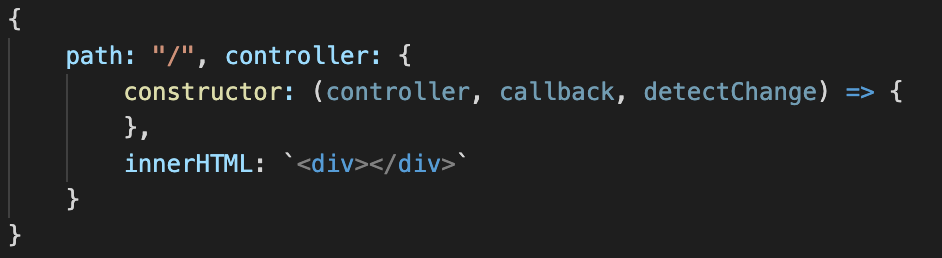

# ES6 String HTML 
> [VSCode Marketplace](https://marketplace.visualstudio.com/items?itemName=Tobermory.es6-string-html)

Adds syntax highlight support for code, placed inner javascript back quote:
- HTML (incl. html in jiji controller)

## Installation

- Install `jiji-framework-syntax` from extensions (`ctrl + shift + x`)

## Usage

Manage syntax for using Jiji Framework

Syntax inner back quotes of your controllers innerHTML `

` :

## Requirements

- Visual Studio Code v1.19.0 recommended
- Using Jiji-framework

## Keybindings
- `ctrl+shift+p` - Search `insert jiji Controller`

## Note
The plugin was inspired by [es6-string-html](https://github.com/0x00000001A/es6-string-html)

## Donation

